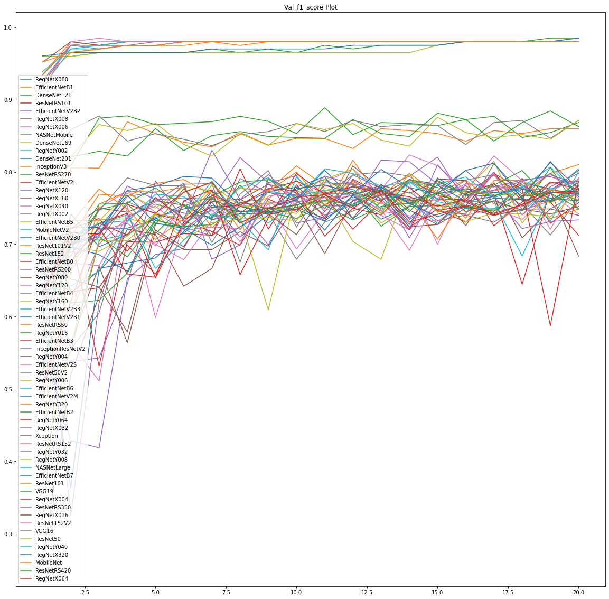
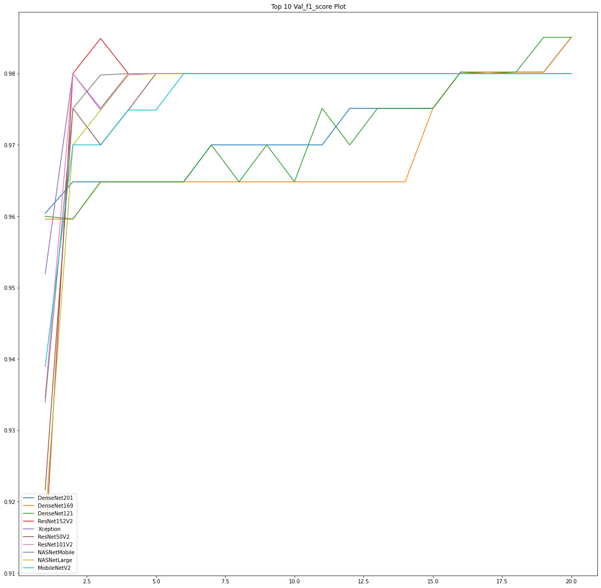

# L-T-EduTech-Hackathon-P1
Deep Learning model for Concrete Crack Detection

## Running this repo:
 The code used for training the deep learning model is the following Colab Notebooks:

 - [L&T EduTech Hackathon P1 - Embedings.ipynb](https://colab.research.google.com/drive/1RA5aOnOGX23br3eGZ3dPZosDVGUsXZBY?usp=sharing)
 - [L&T EduTech Hackathon P1 - Embedings Training.ipynb](https://colab.research.google.com/drive/1RA5aOnOGX23br3eGZ3dPZosDVGUsXZBY?usp=sharing)
 - [L&T EduTech Hackathon P1 - Training.ipynb](https://colab.research.google.com/drive/1074u2XwGiivQwGHOVEHpku-ZGCjqiHUw?usp=sharing)
 - [L&T EduTech Hackathon P1 - MobileNetV3 Training.ipynb](https://colab.research.google.com/drive/1eYiywBciXo8Ab17S9YBYxwcBAiG03BtO?usp=sharing)

 The same code is given in the repo under `notebooks` folder as IPYNB files modified to run locally in Jupyter Notebook or Lab.
 >Note: Numpy, Tensorflow>=2.9, Keras and Tensorflow Addons are required for local run in addition to Python 3.x

 The trained model producing the final result is in the `models` folder. This is the model that gave the final result of:
  >Loss: 0.1671, Accuracy: 0.995, **Precision: 0.9901**, **Recall: 1.0**, **F1 score: 0.995**

More details below.

## Overview:
The model uses transfer learning to reduce training time of the model. Initially, pretrained models are used to create embeddings for all images for all the available pretrained models available in Tensorflow library. The embeddings where trained on a simple dense layer. This allowed us to analyse which models were suitable for this problem.

For this F1 score was used to determine model performance. Candidate models which performed well in validation and testing datasets were:

    - MobileNet Family
    - ResNet50V2, ResNet101V2 & ResNet152V2
    - InceptionV3
    - InceptionResNetV2
    - Xception
    - NASNetMobile & NASNetLarge

>All of these models got an *F1 score* of **0.9800** and **0.9901** in Validation and Test Dataset respectively.

MobileNet was chosen as it was the smallest of these models and could get large inference throughput and small weight sizes. Then **MobileNetV3Small** was trained with frozen base model weights and then finetuned with low learning rate to get following metrics on Test Dataset for the highest Validation F1 score model:
>Loss: 0.1671, Accuracy: 0.995, **Precision: 0.9901**, **Recall: 1.0**, **F1 score: 0.995**

## Key Highlights of this Submission
- Programmtically stepping through `applications` submodule of Keras to extract pretrained Tensorflow `Model` classes and their `preprocess_input` function. No need to manually search for the "best" model for transfer learning.
- Cutting training time during the selection process by caching the embeddings for **all** images in each of the pretrained model obtained programmatically.
- Near 100% scores (accuracy, precision and recall) in final trained model.

## Methodology
My method involved the following objectives:

1. Find a pretrained model whose output encoding correlated well with the training data provided.
1. Use transfer learning to reduce the training time and finetune the model to improve results.

### Initial Round of Model Selection
There are a multitude of open source pretrained vision models for classification. But individually combing through them all is time consuming. So the search is limited to models easily accessable and with uniform APIs that allow programmatic iteration through them. In this regard, **pretrained Tensorflow vision models in the Keras** where selected.

The `applications` submodule of Keras (`tf.keras.applications`), was programmatically iterated through by using the `dir` and `getattr` built-in functions. The resulting Tensorflow `Model` classes from the extraction were paired with their corresponding `preprocess_input` function. With these two elements extracted, a python script was used to compute the the embeddings for all images in the dataset for each of the pretrained model. Notable exception to this was the family of models under `MobileNetV3` which had an inbuilt preprocessing function within the built model and added parameters that determined the architecture.

Embedding array of each model was paired with the corresponding label and trained on small model with droput layer followed a dense layer with one sigmoid output. The F1 scores compared to determine the pretrained model that was use. In case of ties, the model with the lower training/weight file size was used.

### Augmentation Used
The selected model had training input that was augmented to better generalise the model. The augmentation used are:

- Random Brightness (through `tf.image.random_brightness`)
- Random Contrast (through `tf.image.random_contrast`)
- Random Hue (through `tf.image.random_hue`)
- Random Saturation (through `tf.image.random_saturation`)
- Random Left Right Flip (through `tf.image.random_flip_left_right`)
- Random Up Down Flip (through `tf.image.random_flip_up_down`)

The images are not zoomed or shifted from the default (224,224,3) shape mostly due to the presence of regions in Positive images in the dataset that contain no cracks. This might cause false positive labelling of the augmented dataset.

### Finetuning of Selected Model
The augmented data is used to train the model initially with the pretrained weights frozen. Then subsequently the trained model's base is unfrozen and training is continued with a small learning rate.

## Results
All the models have an input shape of BATCH_SIZE x 224 x 224 x 3, although embedding size of each model depends on the pretrained architecture. The added head to all these embeddings is a global average pooling (done within the base model itself), followed by a Dropout Layer with 0.2 probability and a Dense layer with a sigmoid output.

The training dataset embeddings were trained for 20 epochs for each individual model. Here is the Validation F1 scores plotted of all models:

We can see above that some transfer learning models have better performance than others in this list. Here is the top 10 models extracted based on their maximum achieved Validation F1 scores:

The models were also evaluated on the test dataset. The F1 scores of the following models were tied for 0.9901:
- MobileNet Family
- ResNet50V2, ResNet101V2 & ResNet152V2
- InceptionV3
- InceptionResNetV2
- Xception
- NASNetMobile & NASNetLarge

MobileNet Family, specifically MobileNetV3Small, was selected due to its small size, lesser training time and faster throughput.

The final model selected, MobileNetV3Small with alpha 0.75, performed with the following results:
>Transfer Learning + Augmentation: *loss*: **0.1638**, *accuracy*: **0.99**, *precision*: **0.99**, *recall*: **0.99**, *f1_score*: **0.99**

>After Finetuning above: *loss*: **0.1556**, *accuracy*: **0.9950**, *precision*: **0.9901**, *recall*: **1.0**, *f1_score*: **0.995**

## Conclusions and Remarks
For the problem of detecting concrete cracks, multiple models are suitable. If onsite embedded device is the target for this model, the small and portable model provided by MobileNetV3Small is suitable as the model weight size is 2.43 MB and can be further optimised by libraries such as Tensorflow lite.

Some positive images have cracks located at the boundary edge. This seems to unanimously create false negative during evaluation in almost all trained model. In the real world this can be hedged by taking overlapping windows during prediction. Converting the classification problem to a segmentation one can also be done to combat this but with increased labelling effort.

